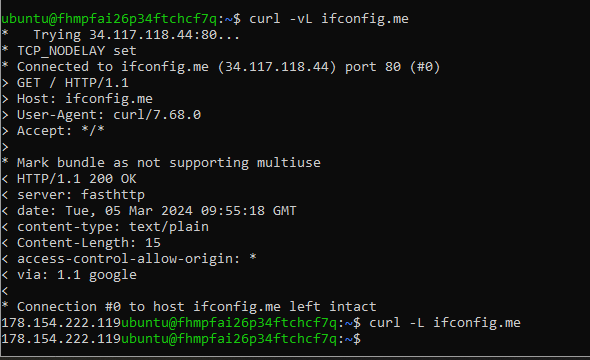

### Задание 1

Ошибка №1

```bash
desc = Platform "standart-v4" not found
```

Платформа  standart-v4  отсутствует среди доступных  в документации  YC (https://cloud.yandex.ru/ru/docs/compute/concepts/vm-platforms).  Среди  стандартных  платформ доступны только ```standard-v1, standard-v2, standard-v3```. Для экономии  ресурсов будем  использовать standard-v2 


Ошибка №2

```bash
desc = the specified number of cores is not available on platform "standard-v2"; allowed core number: 2, 4
```

По описанию  ошибки становтится понятно,  что  при использовани платформы  ```standard-v2``` указаное значение ядер процессора является недопустимым. Согласно документации YC  для ВМ  с уровнем производительности в  5% разрешенным кол-вом  ядер является 2 и 4.(https://cloud.yandex.ru/ru/docs/compute/concepts/performance-levels)


Развернутая в облаке ВМ с выделенным публичным адресом


Результат  выполнения команды curl ifconfig.me



```preemptible = true```  -  по  аналогии с веб консолью  управления YC  это  "прерываемая" (выключится через  24 часа или выключится принудительно,  если возникнет нехватка ресурсов для запуска обычной виртуальной машины в той же зоне доступности)

```core_fraction=5```  - по аналогии с веб-консолью  управления YC это гарантированная доля vCPU (или  согласно  документации  - уровень  производительности)

При использовании  в учебных  целях  применение указанных  параметров позволит  сэкономить средства, выделенные  для обучения, т.к. если студент забудет выключить ВМ  по окончанию  работы с ней, она  выключится сама. Ну а гарантированной доли vCPU в 5% с хватает для выполнения заданий. 


### Задание 4
Вывод  команды ```terraform output```


```bash
[root@terraform01 src]# terraform output
test = [
  {
    "vm_web" = [
      "netology-develop-platform-web",
      "178.154.222.119",
      "fhmpfai26p34ftchcf7q.auto.internal",
    ]
  },
  {
    "vm_db" = [
      "netology-develop-platform-db",
      "158.160.68.6",
      "epd31nrkheu4k8gnhfhk.auto.internal",
    ]
  },
]
```

Прикладываю  листинг получившихся файлов

<details>
  <summary>main.tf</summary>
    
```bash
resource "yandex_vpc_network" "develop" {
  name = var.vpc_name
}

resource "yandex_vpc_subnet" "develop" {
  name           = var.vpc_name
  zone           = var.default_zone
  network_id     = yandex_vpc_network.develop.id
  v4_cidr_blocks = var.default_cidr
}

data "yandex_compute_image" "ubuntu" {
  family  = var.vm_web_compute_image
}

resource "yandex_compute_instance" "platform" {
  name        = local.vm_web_name
  platform_id = var.vm_web_platform
  resources {
    cores         = var.vms_resources.vm_web_resources.cores
    memory        = var.vms_resources.vm_web_resources.memory
    core_fraction = var.vms_resources.vm_web_resources.core_fraction
  }

  boot_disk {
    initialize_params {
      image_id = data.yandex_compute_image.ubuntu.image_id
    }

  }
  scheduling_policy {
    preemptible = true
  }

  network_interface {
    subnet_id = yandex_vpc_subnet.develop.id
    nat       = true
  }

  metadata = {
    serial-port-enable = 1
    ssh-keys           = "ubuntu:${var.wm_web_vms_ssh_root_key}"
  }
}

resource "yandex_vpc_subnet" "develop-b" {
  name           = "${var.vpc_name}-${var.vm_db_zone}"
  zone           = var.vm_db_zone
  network_id     = yandex_vpc_network.develop.id
  v4_cidr_blocks = var.vm_db_zone_b_cidr

resource "yandex_compute_instance" "platform" {
  name        = local.vm_db_name
  platform_id = var.vm_db_platform
  zone        = var.vm_db_zone
  resources {
    cores         = var.vms_resources.vm_db_resources.cores
    memory        = var.vms_resources.vm_db_resources.memory
    core_fraction = var.vms_resources.vm_db_resources.core_fraction
    }
  
  boot_disk {
    initialize_params {
      image_id = data.yandex_compute_image.ubuntu.image_id
    }
  }

  scheduling_policy {
    preemptible = true
  }
  
  network_interface {
    subnet_id = yandex_vpc_subnet.develop.id
    nat       = true
  }

  metadata = var.common_ssh_root_key

}
  ```
  
</details>


<details>
  <summary>variables.tf</summary>

    ```bash
    ###cloud vars
    variable "cloud_id" {
    type        = string
    default     = "b1gjmftgjegm4ag26bp3"
    description = "https://cloud.yandex.ru/docs/resource-manager/operations/cloud/get-id"
    }

    variable "folder_id" {
    type        = string
    default     = "b1gfqj3kv6rieiisg1p5"
    description = "https://cloud.yandex.ru/docs/resource-manager/operations/folder/get-id"
    }

    variable "default_zone" {
    type        = string
    default     = "ru-central1-a"
    description = "https://cloud.yandex.ru/docs/overview/concepts/geo-scope"
    }
    variable "default_cidr" {
    type        = list(string)
    default     = ["10.0.1.0/24"]
    description = "https://cloud.yandex.ru/docs/vpc/operations/subnet-create"
    }

    variable "vpc_name" {
    type        = string
    default     = "develop"
    description = "VPC network & subnet name"
    }

    variable "vm_web_compute_image" {
    type        = string
    default     = "ubuntu-2004-lts"
    description = "ubuntu-2004-lts"
    }

    variable "vm_web_platform" {
    type        = string
    default     = "standard-v2"
    description = "Platform for VM web"
    }

    ###ssh vars

    variable "common_ssh_root_key" {
    type        = map(string)
    default     =  {
        serial-port-enable = 1
        ssh-keys  = "ubuntu:ssh-ed25519 AAAAC3NzaC1lZDI1NTE5AAAAIIn66AMKG3i2jNcUItP9ZlzKPB2FlL9fCuYMi5AQnTDa root@terraform01"
        }
    description = "SSH root key for  all VMs"
    }

    variable "company" {
    type        = string
    default     = "netology"
    }

    variable "environment" {
    type        = string
    default     = "develop"
    }

    variable "project_name" {
    type        = string
    default     = "platform"
    }

    variable "vm_role" {
    type        =  list(string)
    default     =  ["web", "db"]
    }
    ```
  
</details>


