### Задание 1


[ДЗ к лекции 4](https://github.com/netology-code/ter-homeworks/tree/main/04/src)

[демо к лекции 4](https://github.com/netology-code/ter-homeworks/tree/main/04/demonstration1):

TFLint

- не  укаазана версия для провайдера  yandex
- не указана версия для провайдера template
- переменные  vms_ssh_root_key, vm_web_name, vm_db_name, public_key объявлены в  коде, но нигде не используются
- в модулях присутствуют ссылки на ветку main из git без указания конкретного коммита. 

Checkov

- на ВМ назначены публичные  IP, что создает дополнительную  угрозу безопасности,  т.к.  на машину можно попасть  извне
- не назначены  группы  безопасности на сетевые интерфейсы (используется дефолтная группа)
- используется ссылка на источник модуля без хеша, который бы обеспечил неизменяемость данных в источнике


### Задание 2

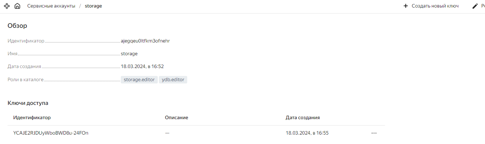
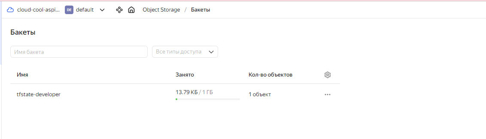
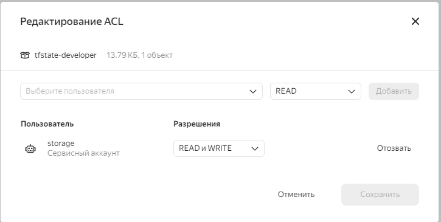
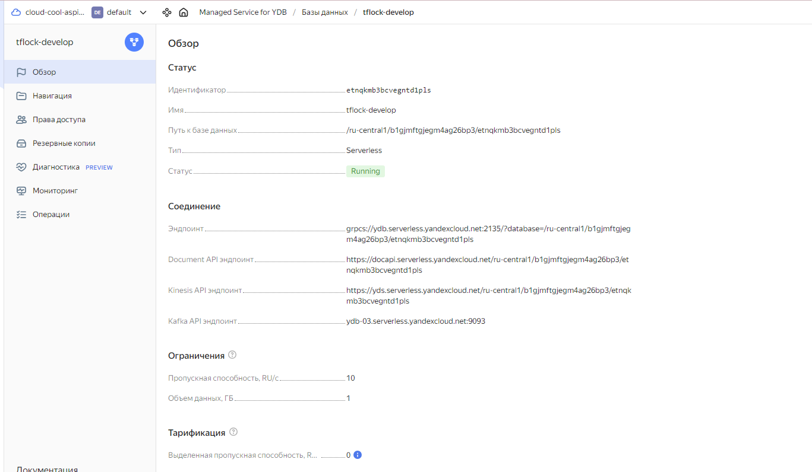
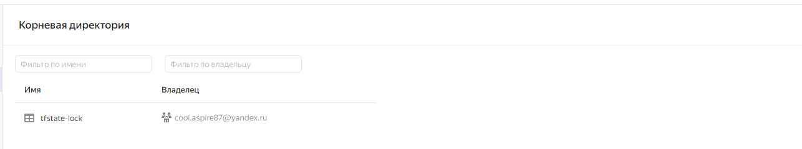
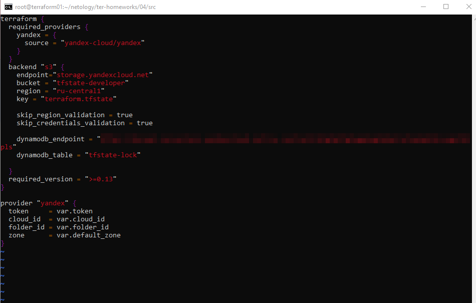
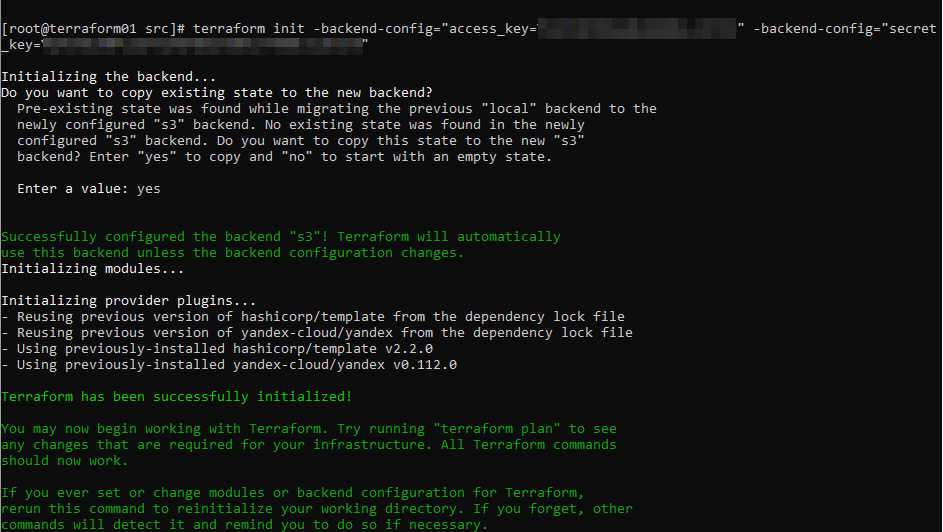
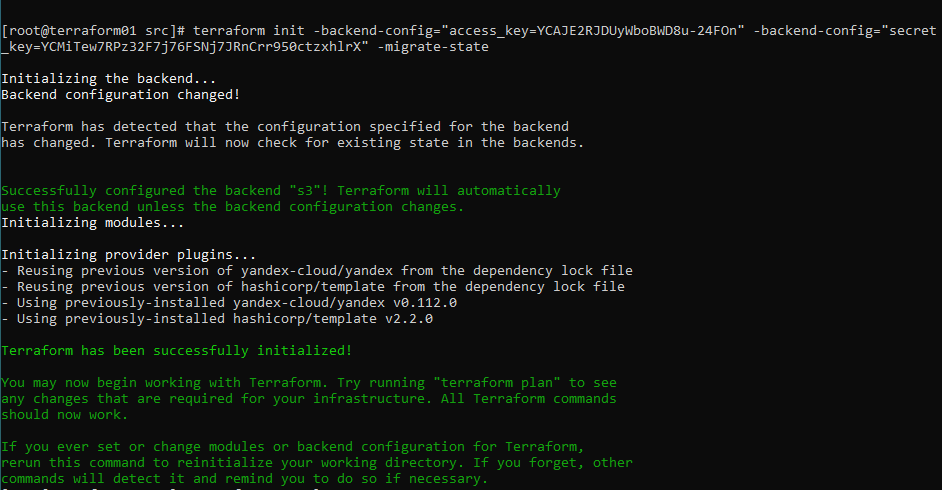
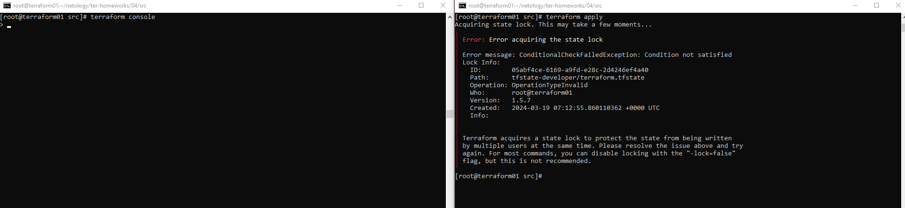
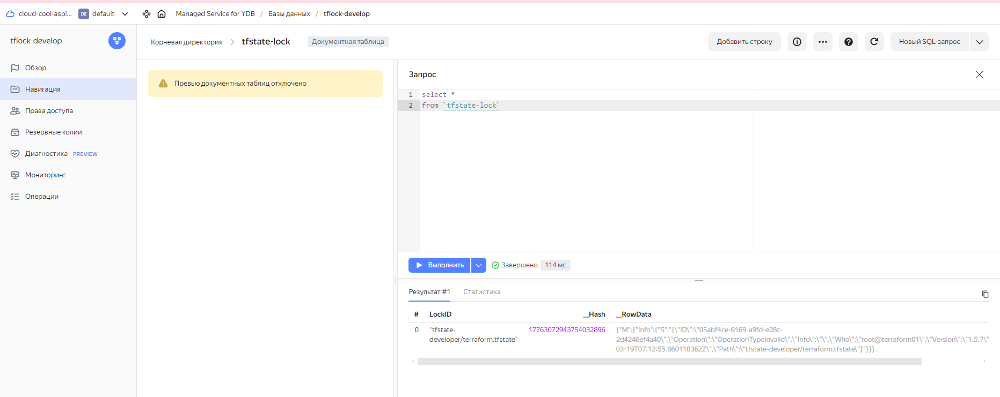
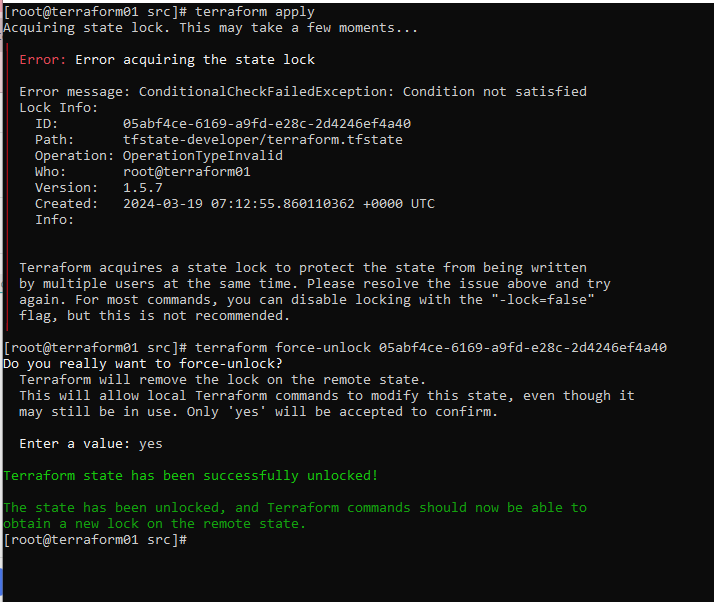


### Задание 3

Ссылка на  [PR](https://github.com/aspire87/ter-homeworks/pull/2)


### Задание 4 

Листинг переменных  из  файла ```variables.tf```
<details>
  <summary>variables.tf</summary>

```bash
### TASK4

variable "ip_address" {
  type = string
  description = "ip-адрес"
  default = "1920.1680.0.1"
  validation {
    error_message = "Invalid ip-address"
    condition = can(regex("^\\d{1,3}\\.\\d{1,3}\\.\\d{1,3}\\.\\d{1,3}$",var.ip_address))
  }
}


variable "ip_address_list" {
  description = "list of IP addresses"
  type        = list(string)
  default     = ["192.168.0.1", "1.1.1.1", "1270.0.0.1"]
  validation {
    condition=alltrue([for ip in var.ip_address_list: can(regex("^\\d{1,3}\\.\\d{1,3}\\.\\d{1,3}\\.\\d{1,3}$",ip))])
    error_message = "Invalid ip-address in list"
  }
}
```
</details>

Если заполнить дефолтные значения некоректными данными, то при запуске ```terraform console``` мы увидим ошибку валидации переменных

```bash
[root@terraform01 src]# terraform console
Acquiring state lock. This may take a few moments...
╷
│ Warning: Due to the problems above, some expressions may produce unexpected results.
│
│
╵

╷
│ Error: Invalid value for variable
│
│   on variables.tf line 32:
│   32: variable "ip_address" {
│     ├────────────────
│     │ var.ip_address is "1920.1680.0.1"
│
│ Invalid ip-address
│
│ This was checked by the validation rule at variables.tf:36,3-13.
╵

╷
│ Error: Invalid value for variable
│
│   on variables.tf line 43:
│   43: variable "ip_address_list" {
│     ├────────────────
│     │ var.ip_address_list is list of string with 3 elements
│
│ Invalid ip-address in list
│
│ This was checked by the validation rule at variables.tf:47,3-13.
╵

>
```